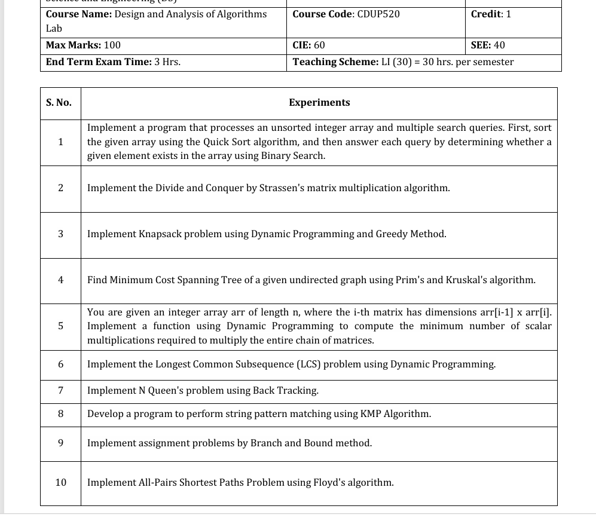

# 🧠 Design and Analysis of Algorithms (DAA) Lab

Welcome to the **Design and Analysis of Algorithms (DAA) Lab** repository! This folder contains C++ implementations of fundamental algorithmic problems, paradigms, and data structures as prescribed in the V-Semester B.Tech syllabus.

---

## 📋 Course Overview

| Category | Details |
| :--- | :--- |
| **Course Name** | Design and Analysis of Algorithms Lab |
| **Course Code** | `CDUP520` |
| **Credits** | `1` |

---

## 🎯 Syllabus & Objectives

Here is the official laboratory syllabus detailing the core experiments to be completed over the semester.

### Syllabus Reference Screenshot


---

## 🧪 Roadmap

Below is a detailed breakdown of the experiments mapped to the syllabus, current implementations, and algorithmic paradigms:

| S.No. | Experiment / Problem Description | Algorithmic Paradigm | Implementation File |
| :---: | :--- | :---: | :---: |
| **1** | Sort an unsorted array using **Quick Sort** and answer search queries using **Binary Search**. | Divide & Conquer / Decrease & Conquer | 
| **-** | Sort an unsorted array using **Merge Sort** *(Core fundamental algorithm)*. | Divide & Conquer | 
| **2** | Matrix Multiplication using **Strassen's Algorithm**. | Divide & Conquer | 
| **3** | **Knapsack Problem** using Dynamic Programming and Greedy Method. | Dynamic Programming / Greedy | 
| **4** | Find the Minimum Cost Spanning Tree (MST) using **Prim's** and **Kruskal's** algorithms. | Greedy | 
| **5** | **Matrix Chain Multiplication (MCM)** to compute the minimum scalar multiplications using Dynamic Programming. | Dynamic Programming | 
| **6** | Find the **Longest Common Subsequence (LCS)** of two sequences using Dynamic Programming. | Dynamic Programming | 
| **7** | Solve the **N-Queens Problem** using Backtracking. | Backtracking |  |
| **8** | String Pattern Matching using the **Knuth-Morris-Pratt (KMP) Algorithm**. | String Matching |  |
| **9** | Solve the **Assignment Problem** using the Branch and Bound method. | Branch and Bound |  |
| **10** | **All-Pairs Shortest Path** problem using **Floyd's Algorithm**. | Dynamic Programming |  |

---

## ⚙️ Compilation & Execution Instructions

Ensure you have a C++ compiler (like `g++` from MinGW/GCC) installed on your system.

### Example for execution of Quick Sort & Binary Search (`Code1.cpp`)
```bash
# Compile
g++ Code1.cpp -o Code1

# Run
./Code1
```

---

## 🛠️ Requirements & Toolchain
- **OS:** Windows / Linux / macOS
- **Compiler:** GCC/G++ compiler supporting C++11 or higher
- **IDE/Editor:** VS Code, CLion, or any standard text editor

---
*By [Khushboo Suwalka](https://github.com/KhushbooSuwalka)*
